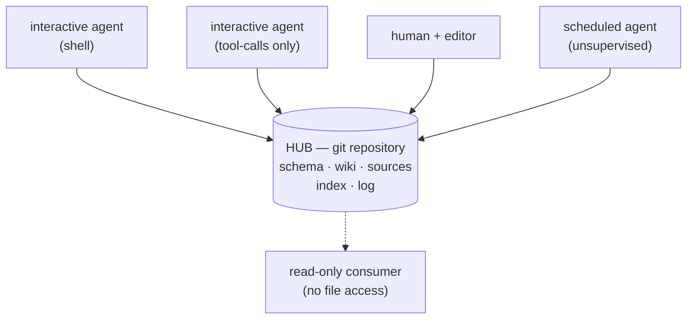
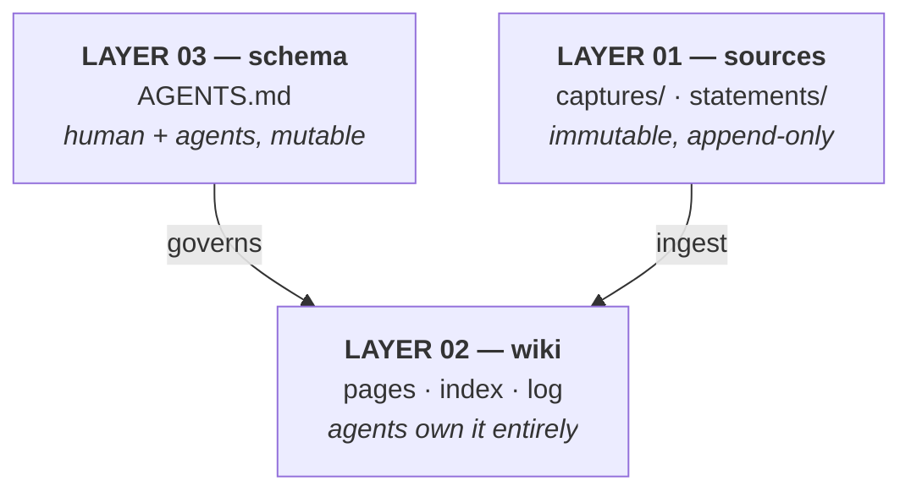
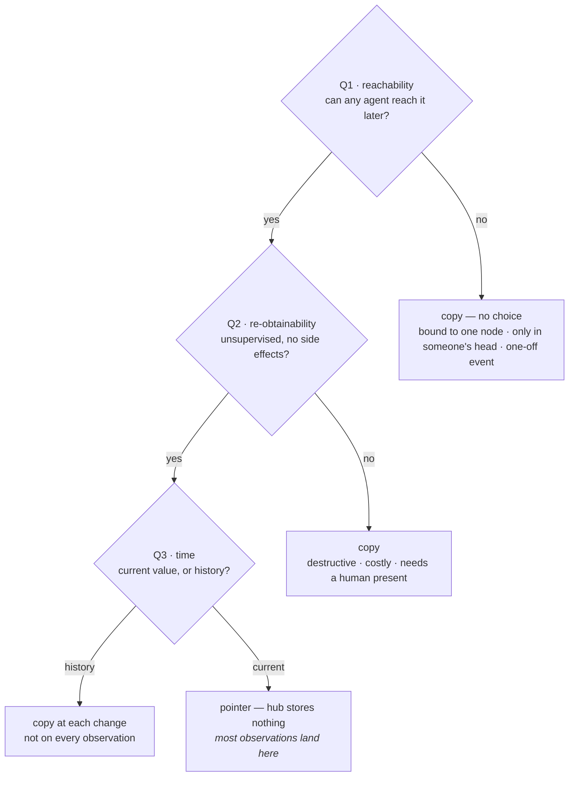
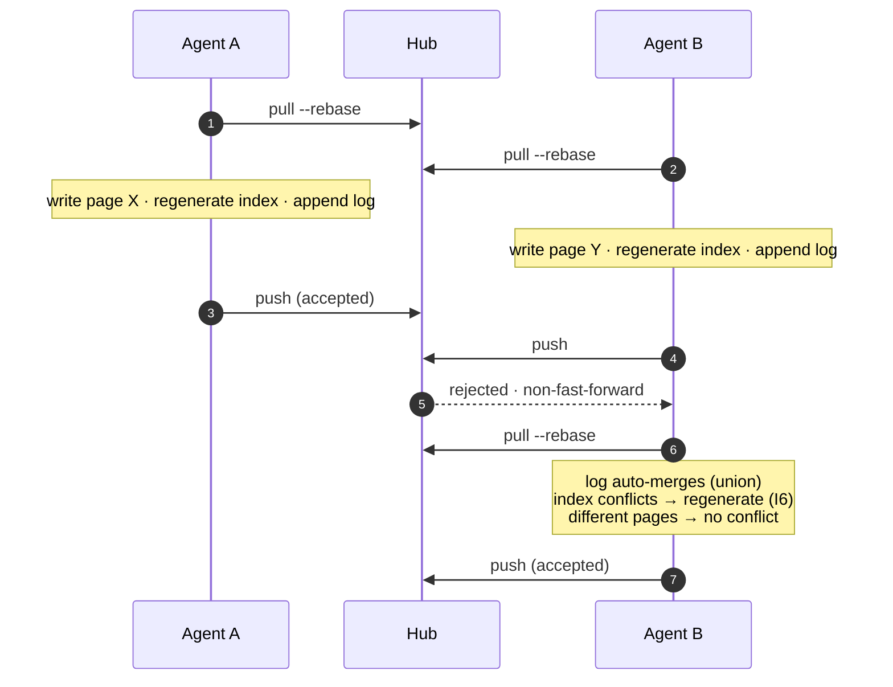

# LLM Wiki Hub — architecture specification

A git repository as the **hub**, any number of interchangeable **agents** as
clients. This document describes the design. To build one, follow
[SETUP.md](SETUP.md) instead — you do not need to read this first.

Derived from [Andrej Karpathy's LLM Wiki](https://gist.github.com/karpathy/442a6bf555914893e9891c11519de94f)
three-layer pattern, extended with the concurrency, admission, and audit rules
that a single-agent design does not need.

---

## 1. Scope

**The problem:** let several LLM agents on several machines maintain one
knowledge base, and be able to tell afterwards who changed what, and on what
grounds.

**Goals**

- Knowledge *accumulates* rather than being re-derived per query.
- Any agent can join at any time — no coordination meeting, no central lock.
- Every claim traces back to a source and a time.
- Mistakes are visible and recoverable.

**Not for**

| Situation | Why | Instead |
| --- | --- | --- |
| One human, one agent, one machine | No concurrency, so the *coordination* machinery is pure cost. The layers and provenance still pay off. | Keep the layers and §6, drop §7 |
| Minute-scale write rates | Every write is a commit; history becomes unusable | A database; feed summaries in |
| Large binary assets | Repository size explodes, diffs are meaningless | External storage plus a pointer |
| Strong consistency required | This is eventually consistent | Storage with transactions |
| Per-directory authorisation | Repository permissions are all-or-nothing | Split into several repositories |

**Boundary.** A machine as an *agent host* is in scope. A machine as a *subject
of knowledge* is not — that is content. The symptom of getting this wrong is
unmistakable: if you find yourself arguing about *which machine should run some
task*, the design has broken. Agents are interchangeable; the question should
not arise.

---

## 2. Model

Two roles. **Hub** is a git repository — the only shared state. **Agent** is
anything that reads and writes files and can run git: interactive, scheduled, or
a human in an editor.

Agents never talk to each other. All coordination goes through the hub. That
single constraint is what buys the main property: adding an agent requires no
change to any existing agent.



---

## 3. Invariants

Eight. Everything else in this document follows from them. If an implementation
decision conflicts with one, the decision is wrong.

| | Invariant | |
| --- | --- | --- |
| **I1** | **The hub is the only shared state** | Agents must not depend on another agent's local state, and never communicate directly. *Bootstrap exception:* the hub's own location cannot live inside the hub; it belongs in each agent's configuration. |
| **I2** | **Agents are interchangeable** | If only one agent can perform some observation, the *product* of that ability must enter the hub at write time — never left as "ask that agent later". |
| **I3** | **Every fact has a source** | A pointer or a copy. A claim with neither is an error, not a style issue. |
| **I4** | **The source layer is append-only** | Files under `raw/` must not be modified or deleted. Line-ending normalisation counts as modification. |
| **I5** | **The knowledge layer is reconstructible** | Every *fact* in `wiki/` must be derivable from `raw/`. Synthesis and organisation need not be. A fact that cannot be reconstructed is really a source and belongs in `raw/`. |
| **I6** | **Generated files are never hand-merged** | Regenerate unconditionally after every sync. Do not resolve by hand, and do not use a merge driver to swallow the conflict. |
| **I7** | **Writes are atomic** | One commit per complete change. Never leave intermediate state in the working tree — another client's automatic commit will sweep it up and destroy attribution. |
| **I8** | **Every change is attributable** | A commit must identify which agent, on which host. Machine-generated sync messages do not satisfy this. |

---

## 4. Layers

Three, all under version control, with different owners.



The ownership split is the point. Layer 02 can be handed to an agent precisely
because I5 makes it reconstructible.

---

## 5. On-disk layout

Layer boundaries **must** be top-level paths. The difference between layers is
ownership, not subject matter — if the boundary hides inside a subfolder, the
"do not touch this" rule has nowhere to attach.

```
<hub>/
├─ AGENTS.md                 layer 03
├─ <tool-specific>.md        one-line pointer to AGENTS.md
├─ INDEX.md                  generated
├─ LOG.md                    append-only
├─ wiki/                     layer 02 — agents own it
│   ├─ <group>/<page>.md
│   └─ assets/               diagrams the agent drew
├─ raw/                      layer 01 — immutable
│   ├─ captures/  YYYYMMDDTHHMMSSZ-<agent>-<subject>.<ext>
│   └─ statements/ YYYYMMDDTHHMMSSZ-<agent>-<subject>.md
├─ tools/build-index.py
├─ .gitattributes
└─ .gitignore
```

| Path | Layer | Written by | Existing content mutable | Conflicts |
| --- | --- | --- | --- | --- |
| `AGENTS.md` | 03 | human + agents | yes | resolve by hand |
| `INDEX.md` | 02, generated | the generator | whole-file rewrite | regenerate (I6) |
| `LOG.md` | operational record | every agent | **no, append only** | `merge=union` |
| `wiki/` | 02 | agents | yes | by hand, should be rare |
| `raw/**` | 01 | any agent | **no (I4)** | prevented by naming |
| `tools/` | infrastructure | human | yes | resolve by hand |

**Naming in `raw/` is a hard requirement, not a style choice.** Timestamps to
the second plus an agent id mean a collision would need the same agent writing
the same subject twice in one second. Date-only names collide inside a single
conversation, where a later statement often corrects an earlier one. No colons —
Windows rejects them. One timezone for the whole hub, declared in the schema;
UTC by default, because local time has a repeated hour and a missing hour every
year, and timestamps inside them can be neither ordered nor disambiguated.

**Same medium, different layer.** A screenshot of something you observed is a
source (`raw/captures/`). A diagram the agent drew to explain something is
knowledge (`wiki/assets/`). The test is I5: the first cannot be reconstructed,
the second can.

**Never in the hub:** agent-local scratch (I1), credentials, auto-updating tool
code (unmergeable binary diffs on every node), editor-local settings, large
binaries.

**Archiving breaks pointers.** Moving old captures does not violate I4 — nothing
is modified — but every provenance pointer to them dies, which violates I3.
Either keep paths stable or update every reference. Cheapest is not to move:
have the generator exclude old captures and leave the files where they are.

---

## 6. Admission — pointer or copy

| Shape | Points at | Can break |
| --- | --- | --- |
| **Pointer** | a commonly-reachable location *outside* the hub | **yes** |
| **Copy** | a file *inside* `raw/` | no |

Pointers are cheap but breakable; copies are durable but accumulate. The
question is only: *will any agent still be able to reach this source later?*



None of the three asks *which machine*. They ask about the reachability class of
the source, which holds for any domain.

**Why the shape matters, beyond storage.** A copy sitting in the hub *looks
authoritative* — it is in the source layer, timestamped, well-formed, and
nothing warns the reader it may be months stale. A pointer is self-warning: it
reads as "go and check". Storing something still reachable demotes a verifiable
fact into stale-looking data; pointing at something unreachable throws the
knowledge away.

**Q1 is asymmetric, so bias towards copying.** A redundant copy is noise. A
missing copy is gone.

Q1 also satisfies I2 for free: once a node-bound fact enters the hub at write
time, no agent ever needs to touch that node again. Reachability is solved at
the door, not deferred to verification time — which is why no "which agent can
verify what" tiering is needed.

### Statements

Speech is full of deixis — "this project", "that machine", "it". Those
references resolve against a conversation that will not exist tomorrow, so a
verbatim transcript keeps the words and loses the meaning. A summary alone is
equally wrong: when a fact later proves false, you must be able to separate *the
human said it wrong* from *the agent heard it wrong*, and the latter is both
more common and more fixable.

The resolution of those references **is itself an irretrievable source**, so it
is captured alongside the words rather than replacing them. Resolve references
only, never conclusions: "this project = Foo" belongs in the statement, "so
Foo's build must change" belongs in the wiki.

Three sections — verbatim, resolution, open — plus a **required `scope`** field.
Scope decides where the fact is filed, and both ways of getting it wrong are
silent: a local quirk filed as a general rule misleads everywhere else; a
general rule filed as a local quirk is never found again. When scope is
unclear, ask. Required means a health check can detect its absence.

A wrong resolution is corrected by **writing a new statement**, never by editing
the original (I4) — no erasure, an erratum.

---

## 7. Concurrency

Conflicts only hurt when two writers touch the same file. Pages split finely
almost never collide; the two files everyone touches always do.



```gitattributes
LOG.md            merge=union
raw/**            -text
*.md              text eol=lf
```

**`INDEX.md` deliberately has no merge driver.** Git ships no built-in `ours`
driver, so `INDEX.md merge=ours` does nothing unless `merge.ours.driver` is also
configured — and if it is, it silently picks a side and swallows the conflict,
which is exactly what must not happen: the agent then never learns to
regenerate. Let it conflict; regenerate unconditionally after every sync.

**`LOG.md` order is not reliable.** Union keeps both sides, but which comes
first follows merge direction — union puts "ours" first, and a rebase swaps
which side that is. The result may coincidentally look chronological. Always
sort: `grep "^## \[" LOG.md | sort | tail -20`. This is the second reason
timestamps must go to the second — within one day, a date-only stamp cannot be
sorted at all.

### Write protocol

1. `git pull --rebase`
2. Read the schema, the index, and the tail of the log. **Do not assume the
   schema is loaded** — auto-loading is a tool feature, not a guarantee.
3. **Search before creating.** Extend an existing page rather than opening a
   second one on the same subject. Duplicate pages are the fastest way to kill a
   multi-agent knowledge base.
4. Run the three gates; land `raw/` before the wiki. Filter secrets at capture
   time.
5. Write the page; update `updated` and `summary`; mark unverified inferences.
6. Regenerate the index **unconditionally**. Do not rely on git hooks — some
   sync clients bypass them.
7. Append one line to the log.
8. `git add` named files — **never `add -A`** — commit with an attribution tag
   (I8), push.

Keep steps 1–8 short (I7). Never delete another writer's content; mark it as
disputed with who and when — the one raising the doubt can also be wrong.

---

## 8. Retrieval

At tens to hundreds of pages, a generated index replaces embedding
infrastructure entirely: cheap, auditable, no extra service, always consistent
with the tree.

1. **Read the index** — one file: what exists, where, how fresh, and who links
   to whom. The backlinks table answers "what else touches this subject"
   without opening anything.
2. **Text search** — narrow to a handful of pages.
3. **Read those pages** — follow internal links one hop; answer with precise
   locations and retrieval times.
4. **Vector search** — usually unnecessary. Add it when the index itself grows
   too large to read, or search routinely returns too many pages. It replaces
   step 2 and changes no other layer.

`summary` is what makes the index work; without it the index is just a file
listing. That is why it is required rather than optional.

The scale ceiling here is a *retrieval* limit, not an architectural one. At
thousands of pages only step 2 degrades.

---

## 9. Agent tiers

I2 says agents are interchangeable in *capability*, not that tools are
identical. One real asymmetry exists: **whether the agent can run git itself.**

| Tier | Access | Can commit | Note |
| --- | --- | --- | --- |
| Shell-capable | direct file access to a clone | yes | schema auto-loads |
| Tool-calls only | filesystem tool pointed at a clone | needs a VCS tool | avoid bridges that require an editor to be running |
| Human + editor | the clone is the working directory | plugin does it | keep auto-sync on; auto-commit only where a restricted agent writes |
| Human + editor | the clone is the working directory | plugin does it | see below — the only silent write path |
| No file access | none | no | feed the index and pages via prompt; read-only |

The fallback — letting a sync plugin sweep up an uncommitted write — works, but
its commit messages are machine-generated, so it **violates I8**. Data stays
correct; auditability does not.

**An editor is the only client that can break I4 without anyone noticing.**
Every other writer passes through the protocol; an editor writes on keystroke.
Hiding `raw/` from its search and navigation removes the accident, but that
exclusion is invisible to file-writing tools — it protects humans, not agents.
Editors also default to storing pasted attachments at the repository root,
outside every layer, so the attachment path has to be set deliberately. Watch
for **more than one automatic-commit trigger**: a sync plugin may commit both on
a timer and on file change, and disabling one leaves the other running.

Before adding any editor plugin, ask whether it writes into the knowledge layer,
whether it touches `raw/`, whether its writes are triggered by a person or by a
schedule, and whether its output paths are configurable. A hardcoded output
directory cannot be worked around. Plugins that only *read* frontmatter are
always safe, and are unusually useful here: `type`, `updated`, and `summary` on
every page is exactly what a query plugin needs.

An agent whose working directory is *not* the hub hits three problems, all the
same shape: the tool assumes the working directory is the subject. File access
is scoped to it; the schema does not auto-load; git resolves to the wrong
repository. Fixes: grant the hub path explicitly, carry the protocol in a
user-level skill whose first instruction is to read the schema, and always name
the repository in git commands. Allow-list only the repository-qualified form,
so a forgotten one prompts instead of committing to the wrong place.

---

## 10. Health checks

The knowledge base is a shared artifact with several writers. You would not let
several authors push to main with no review and no CI — the periodic health
check *is* the CI. It is an ordinary agent (I2); where it runs does not matter.

**Failure modes to detect**

- Contradiction — two pages, same subject, different conclusions
- Duplication — the same subject opened twice
- Staleness — `updated` or a provenance timestamp too old
- Orphan page — no inbound internal link (the generator reports these; an
  entry point legitimately has none, so this is a warning, not an error).
  Count links from every page outside `raw/`, and count both link syntaxes — a
  narrower definition invents orphans that are not orphans.
- Orphan copy — a file in `raw/` no page references

**Enforcing admission.** Prose rules in the schema are soft: an agent under time
pressure skips them and you never find out. The judgement is made checkable by
requiring its *output* to be a pointer or a copy — because a missing marker is
mechanically detectable.

1. A claim with no provenance — the gates were never run (I3)
2. A provenance path into `raw/` that does not exist
3. Near-duplicate copies — something pointer-worthy was copied; Q1 or Q2 was
   misjudged
4. A pointer-form provenance past its age threshold — follow it and compare
5. A statement with no `scope`, or one marked open but cited as settled
6. A commit with no attribution tag (I8)

**What it cannot catch.** It detects *no judgement*, not *wrong judgement*. Rule
3 is the only oblique catch, and only in one direction — copied when it should
have pointed. The reverse, *should have copied and did not*, is undetectable
forever, because the source is already gone. That asymmetry is exactly why Q1
biases towards copying.

**An unsupervised agent must not change facts.** It may mark, log, and raise
issues. Unattended plus auto-push turns one misjudgement into a recurring one.

Automation splits into three separate things: **auto-sync** (should be on, short
interval, no write risk); **auto-commit** (selective — it violates I8, keep it
only where a restricted agent writes); **scheduled health check** (unsupervised;
location irrelevant).

---

## 11. Decision points

Everything above is fixed — that is the design. These are parameters: get one
wrong and the hub is inconvenient, not broken.

| Decision | Options | Effect |
| --- | --- | --- |
| Folder taxonomy | by subject / by type / flat | Search efficiency and index grouping. Flat is fine for dozens of pages. |
| Frontmatter fields | minimal (type / updated / summary) → rich | More fields, more omissions, noisier health checks. **Start minimal.** |
| Page granularity | coarse / fine | **Directly sets the conflict rate.** Fine granularity keeps writers off each other's files. |
| Sync interval | minutes / manual | Shorter means fewer conflicts, more client load. |
| Auto-commit | on / off / selected nodes | On produces meaningless messages (violates I8); off strands restricted agents' writes. |
| Timezone | UTC / one fixed local zone | Must be uniform hub-wide or lexical filename order stops matching time order. Local time has DST; UTC does not. |
| Filenames | ASCII-only / unrestricted | Cross-platform sync and mobile git implementations vary in their handling of non-ASCII. |
| Internal link syntax | wiki-style `[[…]]` / relative markdown | **Only wiki-style editors resolve `[[…]]`.** In a git host's web view or a phone browser they are inert text. Relative markdown links work in both. Choose by where pages are *read*, not where they are written. |
| Token scope | single repository / account-wide | Sets the blast radius when an agent is compromised. **Use single-repository.** |
| Source retention | forever / periodic archive | Forever is safest but degrades the index. Archiving must not break pointers. |
| Health-check frequency | per write / daily / weekly | More often finds problems sooner; an unsupervised agent running more often carries more risk. |

**Secrets are the one parameter with no options.** Hub contents may be synced
beyond your control, and git history is effectively permanent — deleting the
file later does not remove the value. Passwords, tokens, private keys, and
licence codes never enter the hub; record where a credential lives, not the
credential. This belongs at the very top of the schema, not in an appendix.

---

## 12. Adoption order

The sequence matters: rules before the second writer; the supervised path stable
before anything unattended.

1. Create the repository, lay out the three layers, exclude tool settings from
   version control — **especially auto-updating plugin code**.
2. Write the schema. Secrets rule first, then layers, the write protocol, log
   format, commit conventions.
3. Add `.gitattributes`.
4. Create the source layer and the index generator. Backfill facts that so far
   exist only inside prose as statements.
5. Run one writer through the full protocol once.
6. **Add a second writer and force a conflict.** Confirm the log union-merges,
   the index conflicts and regenerates cleanly. This step is verification, not
   ceremony.
7. Bring the remaining writers online, each with a repository-scoped token.
8. Connect restricted agents.
9. **Last**, schedule the unsupervised health check.
